# books_gr5
### API REST con la finalidad de dar solución a los siguientes retos:
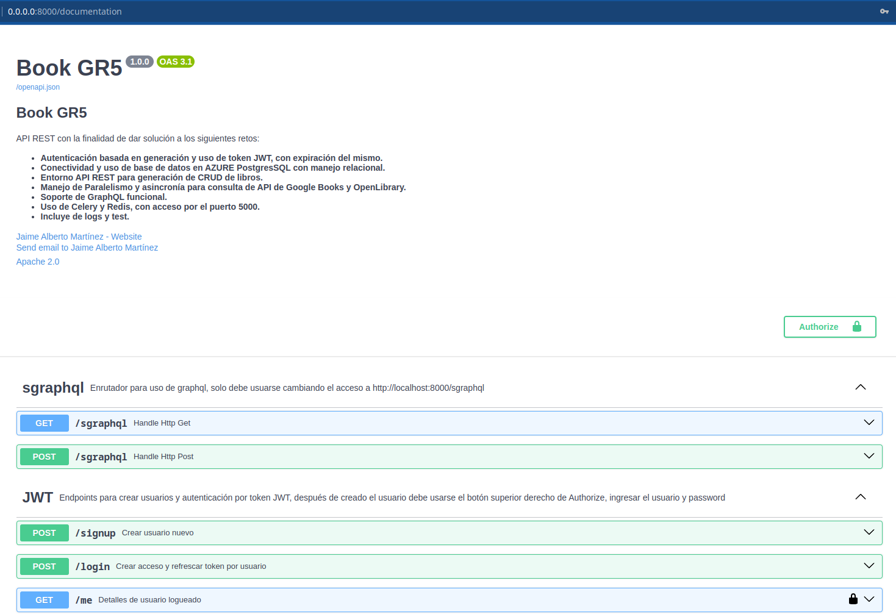 

**[JWT](http://0.0.0.0:8000/login)** Autenticación basada en generación y uso de token JWT, con expiración del mismo.
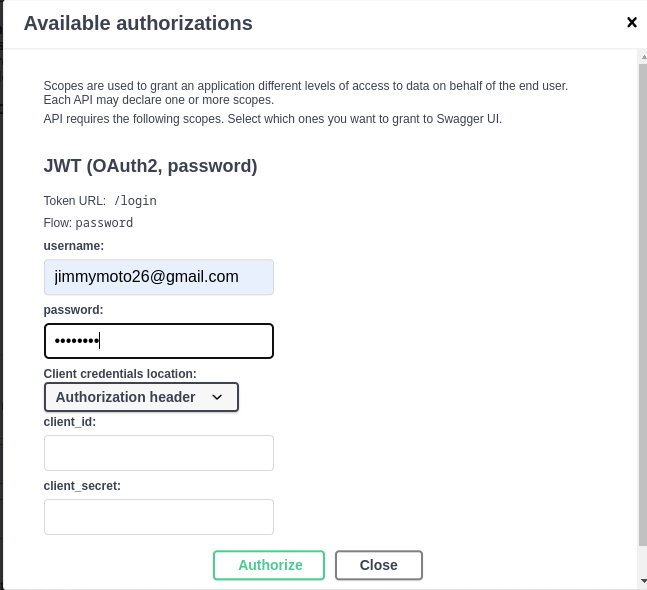
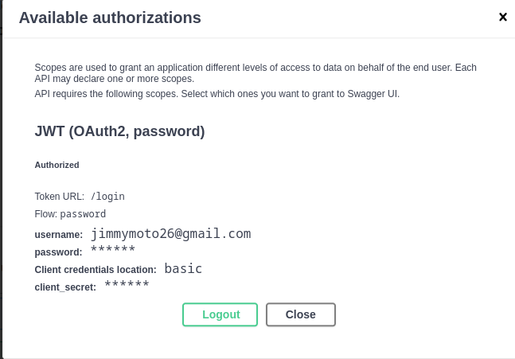

**[AZURE](https://portal.azure.com/)** Conectividad y uso de base de datos en AZURE PostgresSQL con manejo relacional.
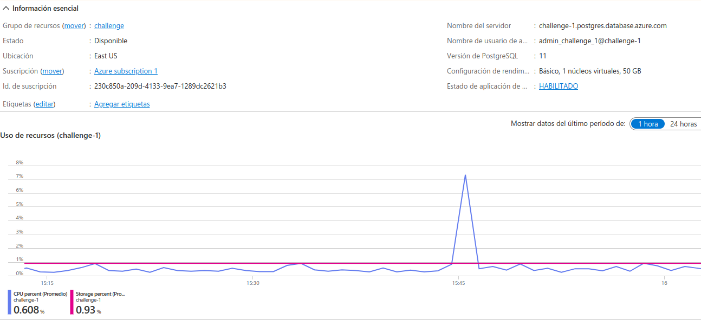

**[CRUD](http://0.0.0.0:8000/book)** Entorno API REST para generación de CRUD de libros.
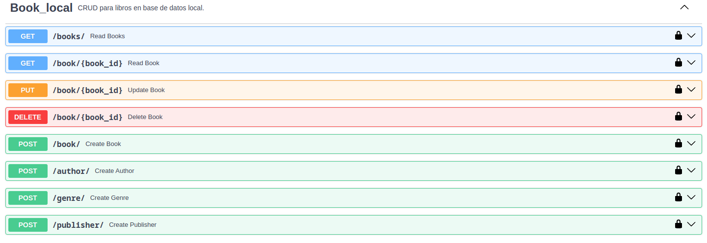

**[Paralelismo](http://0.0.0.0:8000/search_attributes)** Manejo de Paralelismo y asincronía para consulta de API de Google Books y OpenLibrary.
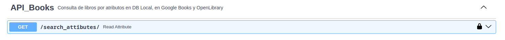
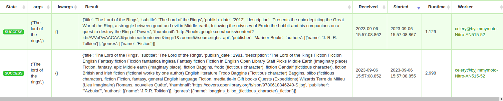

**[GraphQL](http://0.0.0.0:8000/sgraphql)** Soporte de GraphQL funcional.
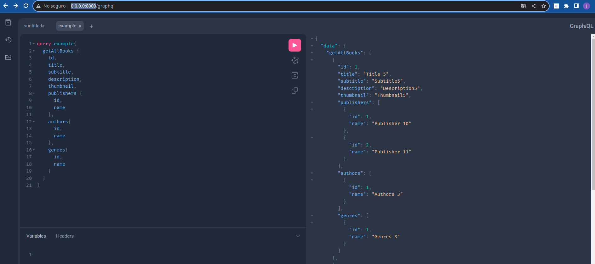

**[Celery](http://0.0.0.0:5000)** Uso de Celery y Redis, con acceso por el puerto 5555.
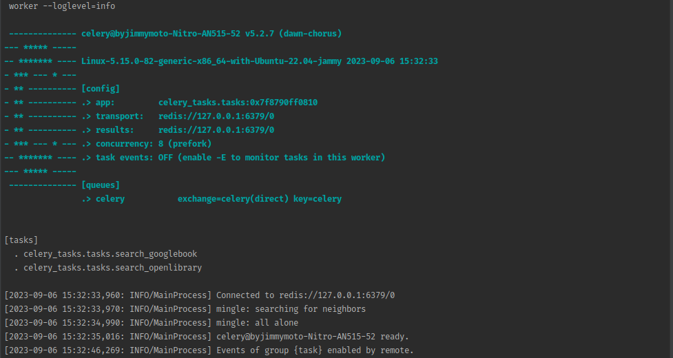
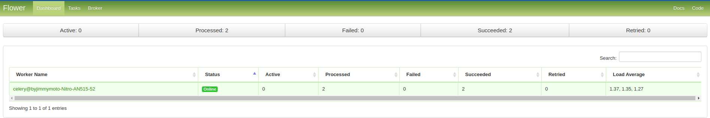
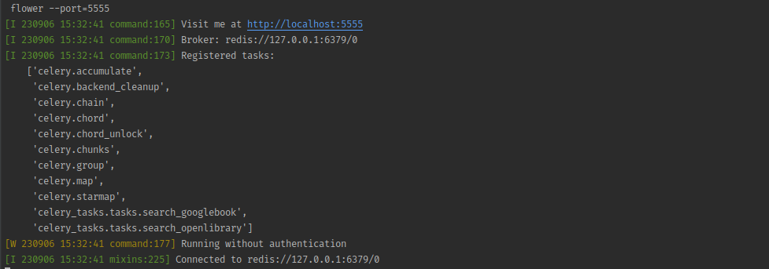

**[Test](http://0.0.0.0:8000/documentation)** Incluye de logs y test.
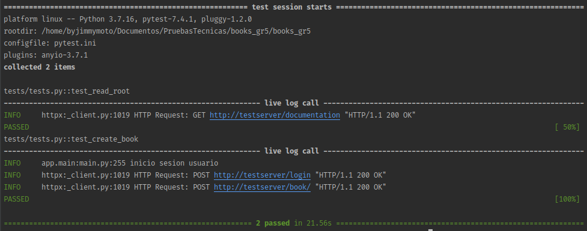
